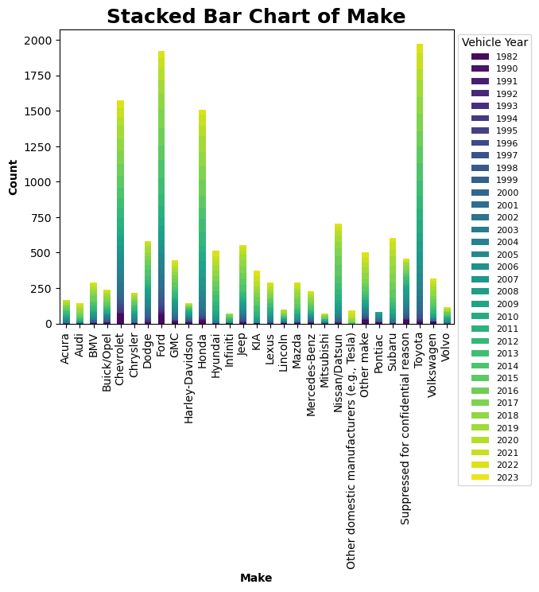

## Projects
### Project 1: National Household Travel Survey (NHTS) and the Next Generation Simulation (NGSIM) Analysis

*This project was about vehicle and household data*
---
### Project 2: Risk data analysis

*this is about risk in the counties of Wyoming comparing drought and landslides*
---
- [Home](index.md)
---